# Texture Tinker Tool

## Introduction

The 3D drawing tool [ThreeJS](https://threejs.org/), its React rendering solution [React Three Fiber](https://github.com/pmndrs/react-three-fiber), and on its turn the R3F abstraction library [Drei](https://github.com/pmndrs/drei) can be useful in making quick and beautiful 3D creations. And there are many other useful ThreeJS tools, helpers, libraries and documentations available around the web. However, on the level of drawing and handling _images and textures_ there is not much available, except for professional designers and experts in handling expensive photo drawing and editing programs.

So I decided to create a tool where you can draw, edit, optimize and even animate your textures in an easy-to-use React environment. In a similar way popular drawing programs can handle photos and images, you can stack layers and blend them together, transform, filter and retouch them, add effects to them and draw shapes. To increase the performance, once an image, layer or texture is loaded or rendered, it is cached and reused for when the exact same input data is called a second time.

The Texture Tinker Tool is a fast, powerful, elegant and dynamic texture editor, to use together with [ThreeJS](https://threejs.org/) and [React Three Fiber](https://github.com/pmndrs/react-three-fiber). It helps you to dynamically optimize your textures thanks to the many features available in the [Canvas Rendering Context](https://developer.mozilla.org/en-US/docs/Web/API/CanvasRenderingContext2D) interface, like [filters](https://developer.mozilla.org/en-US/docs/Web/API/CanvasRenderingContext2D/filter), [composite operations (blending)](https://developer.mozilla.org/en-US/docs/Web/API/CanvasRenderingContext2D/globalCompositeOperation), [gradient](https://developer.mozilla.org/en-US/docs/Web/API/CanvasRenderingContext2D/createLinearGradient) and additional effects like [bloom](<https://en.wikipedia.org/wiki/Bloom_(shader_effect)>), alpha channel mapping, and outline effects.

## Installation

```
npm install @react-three/texture
```

...or...

```
yarn add @react-three/texture
```

## Prerequisites

Before you start you need to know a bit about React, ThreeJS and React Three Fiber. If you need any additional help on these topics, please refer to the following links:

- [React](https://reactjs.org/docs/getting-started.html)
- [ThreeJS](https://threejs.org/)
- [React Three Fiber](https://docs.pmnd.rs/react-three-fiber/getting-started/introduction)

## Quickstart Example

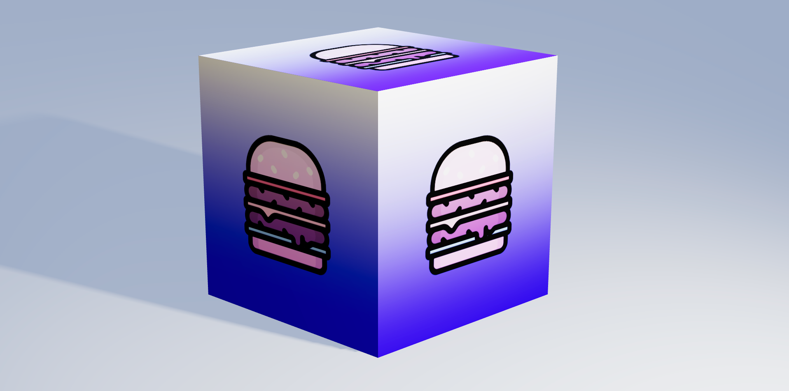

```jsx
import { TextureSet, Layer } from "@react-three/texture";

<mesh castShadow>
  <boxBufferGeometry attach="geometry" />
  <meshStandardMaterial attach="material">
  <TextureSet>
    <Layer fill="blue" />
    <Layer gradient blend="lighter" />
    <Layer src="burger.svg" scale={[0.5, 0.5]} image="center middle" blend="hard-light" />
  </TextureSet>
</mesh>;
```

## Documentation

### TextureSet

A texture containing a set of layers. All features like _map_, _offset_, _repeat_ and _rotation_ that are normally available for the basic `Texture` object, can also be used here. Its children can only be layers. [Read more about ThreeJS Textures](https://threejs.org/docs/#api/en/textures/Texture).

```jsx
<TextureSet {...props}>{children}</TextureSet>
```

### Layer

[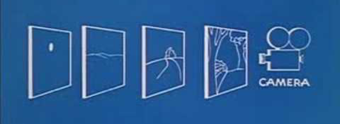](./public/readme-layer.png)

Layers are like a stack of transparent film paper, used in old animated movies. The bottom layer will be shown at the back, then the second layer, etcetera. All layers together will form one single texture.

```jsx
<Layer {...props1} /> // Will be drawn first and is displayed in the back
<Layer {...props2} />
<Layer {...props3} />
<Layer {...props4} /> // Will be drawn last and is displayed in the front
```

#### Src

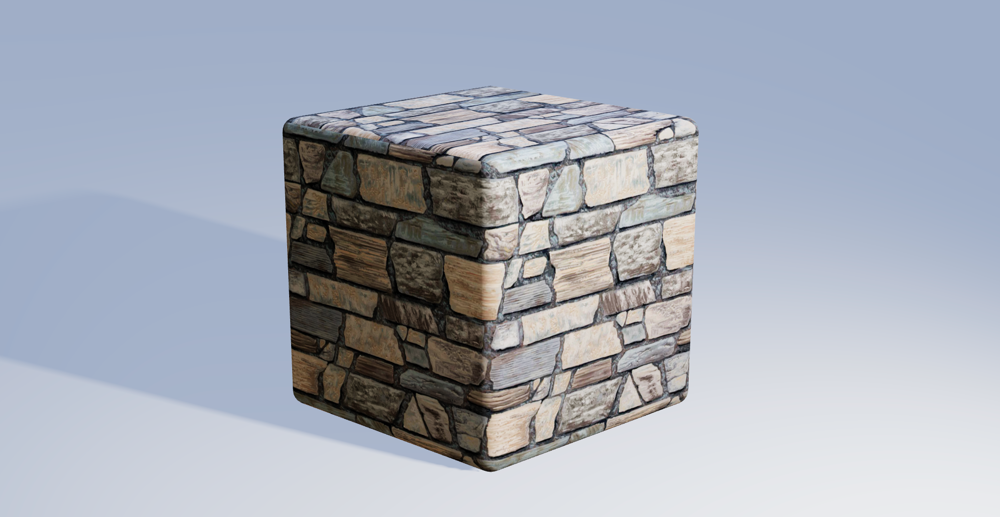

Will directly load an image source onto the texture. All loaded images will be cached, to increase performance. I.e. when the same image is used somewhere else there will be no reloading. It is also possible to load SVG files, and even external sources can be used.

```jsx
<Layer src="image.png" />

<Layer src="image.svg" />

<Layer src="https://images.unsplash.com/photo-1581373449483-37449f962b6c" />
```

#### Basic transformations

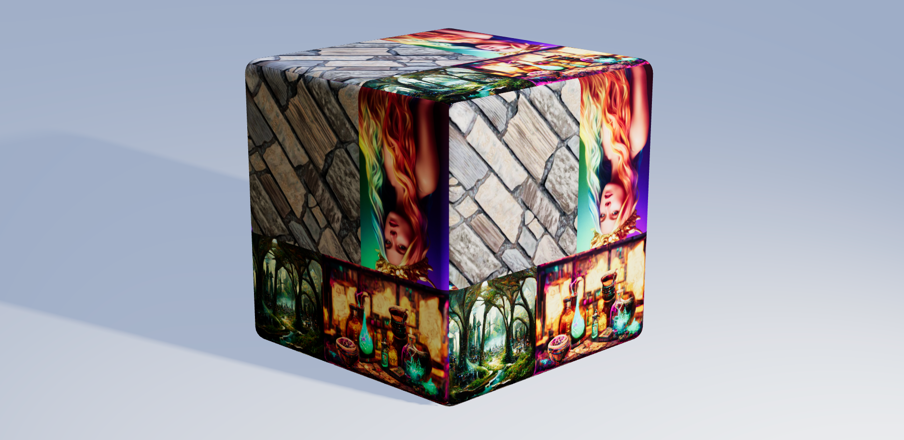

All layers can separately be moved, scaled and rotated, relative to the texture.

```jsx
<Layer src="image.png" position={[0.5, 0.5]} />

<Layer src="image.png" position={[0.2, 0.2]} scale={[0.8, 0.8]} />

<Layer src="image.png" rotation={Math.PI * 0.5} />
```

| property | default value | arguments | description                                                                                            |
| -------- | ------------- | --------- | ------------------------------------------------------------------------------------------------------ |
| position | `[0, 0]`      | x, y      | The position of the layer.                                                                             |
| scale    | `[1, 1]`      | w, h      | The scale of the layer.                                                                                |
| rotation | `0`           | rad       | The rotation of the layer in radians. The rotation will be done relative to the center of the texture. |

#### Image transformations

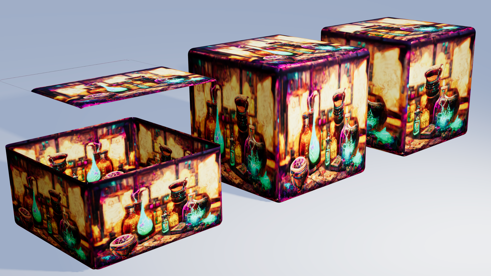

Images that are not exactly square sized can be fit in the texture as we like without getting deformed. We can choose to fit a rectangular sized image on a square sized texture, while keeping the aspect ratio of the image. Also, when the image is too big to fit on the texture we can choose to position the image to a side.

```jsx
<Layer src="image.png" image />

<Layer src="image.png" image="fit-max" />

<Layer src="image.png" image="fit-x middle center" />
```

| string        | description                                                                                                                       |
| ------------- | --------------------------------------------------------------------------------------------------------------------------------- |
| fit-fill \*\* | Image will be resized to match the given dimension, and may stretch it to fit.                                                    |
| fit-max \*    | Will fit the image to whichever side (width or height) is smaller, and keeping the image's aspect ratio. This may clip the image. |
| fit-min       | Will fit the image to whichever side (width or height) is larger, and keeping the image's aspect ratio.                           |
| fit-x         | Will fit the image to its width, and keeping the image's aspect ratio.                                                            |
| fit-y         | Will fit the image to its height, and keeping the image's aspect ratio.                                                           |
| fit-none      | Will not fit the image and will keep its original size.                                                                           |
| top \*\*      | Will align the image to the top.                                                                                                  |
| right         | Will align the image to the right.                                                                                                |
| bottom \*\*   | Will align the image to the bottom.                                                                                               |
| left          | Will align the image to the left.                                                                                                 |
| center \*     | Will horizontally align the image to the center.                                                                                  |
| middle \*     | Will vertically align the image to the middle.                                                                                    |

\* default, when defining the property "image" without a value

\*\* default, when not defining the property "image"

#### Color

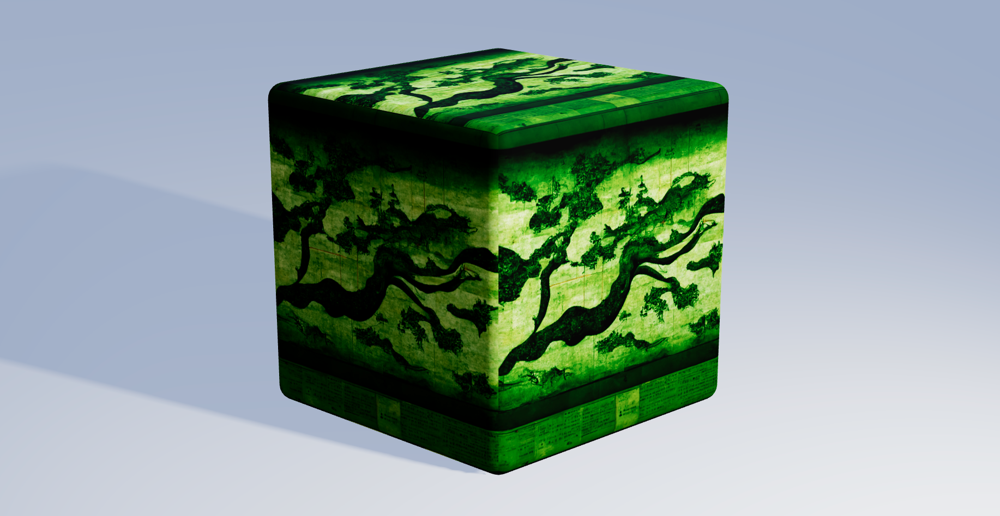

Overwrite the colors in your layers with a single color. Useful to colorize your monochrome SVG images. When setting the alpha channel lower than 100% it will blend the original colors with the overwritten color

```jsx
<Layer src="image.png" color="red" />

<Layer src="image.png" color="#ff000080" />

<Layer src="image.png" color="#rgba(255, 255, 0, 0.7)" />
```

#### Fill

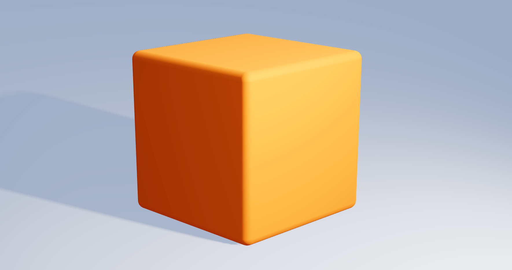

Will fill the layer with a single color. The alpha channel can also be used to make the fill color (semi-)transparent.

```jsx
<Layer fill="darkBlue" />

<Layer fill="#ff8800" />

<Layer fill="#00ff0080" />

<Layer fill="rgb(128, 0, 128)" />
```

#### Gradient

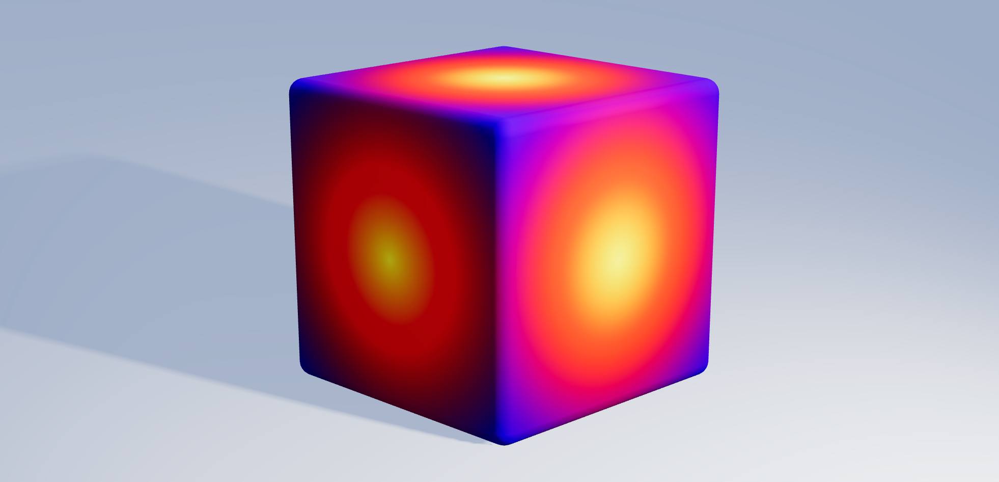

Gradients is an operation to smoothly blend two or more colors into each other. See the [linear gradient page](https://developer.mozilla.org/en-US/docs/Web/API/CanvasRenderingContext2D/createLinearGradient) and the [radial gradient page](https://developer.mozilla.org/en-US/docs/Web/API/CanvasRenderingContext2D/createRadialGradient) of the MDN web docs for more information.

```jsx
<Layer gradient />

<Layer gradient={{ stops: [[0, "#008800"], [1, "#88ff88"]] }} />

<Layer
  gradient={{
    type: "radial",
    from: [0.5, 0.5, 0],
    to: [0.5, 0.5, 0.75],
    stops: [
      [0, "yellow"],
      [0.4, "red"],
      [1, "blue"],
    ],
  }}
/>
```

| key   | default value                  | arguments        | description                                                                                           |
| ----- | ------------------------------ | ---------------- | ----------------------------------------------------------------------------------------------------- |
| type  | `"linear"`                     | linear or radial | the type of gradient. Can be linear or circular.                                                      |
| from  | `[0, 0]` or `[0.5, 0.5, 0]`    | x, y, r?         | The starting point of the gradient. The radius (r) only applies for radial gradients.                 |
| to    | `[0, 1]` or `[0.5, 0.5, 1]`    | x, y, r?         | The end point of the gradient. The radius (r) only applies for radial gradients.                      |
| stops | `[[0, "white"], [1, "black"]]` | index, color     | The stop index and color between the start and the end point. Multiply stops and indexes can be used. |

#### Image smoothing


Turn off image smoothing for the layer (the "nearest neighbour" algorithm), when scaling/fitting the image. See the [image smoothing page](https://developer.mozilla.org/en-US/docs/Web/API/CanvasRenderingContext2D/imageSmoothingEnabled) of the MDN web docs for more information.

```jsx
<Layer img="image.png" nearest />
```

#### Shadow and glow

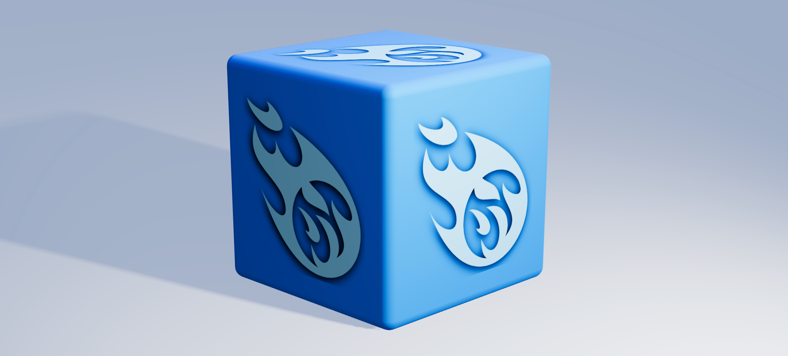

Apply a shadow (or glow) effect to the layer. See the [shadow page](https://developer.mozilla.org/en-US/docs/Web/API/CanvasRenderingContext2D/shadowBlur) of the MDN web docs for more information.

```jsx
<Layer src="image.svg" shadow={{ color: "black", blur: 30, offset: [-5, 5] }} />
```

| key    | default value | arguments | description                                        |
| ------ | ------------- | --------- | -------------------------------------------------- |
| color  | `"black"`     |           | The color of the effect                            |
| blur   | `20`          | 0 to x    | The blur radius of the effect                      |
| offset | `[0, 0]`      | x, y      | The position offset from the center of the effect. |

#### Outline

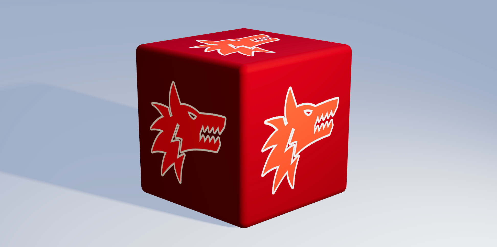

You can give your image an outline effect. Other than shadow or glow, outline will not be smooth and does not have an offset.

```jsx
<Layer src="image.svg" outline />

<Layer src="image.svg" outline={{ color: "black", size: 10, detail: 10 }} />
```

| key     | default value | arguments | description                                                                                  |
| ------- | ------------- | --------- | -------------------------------------------------------------------------------------------- |
| color   | `"black"`     |           | The color of the outline.                                                                    |
| size    | `1`           | 1 to x    | The thickness of the outline.                                                                |
| quality | `8`           | 1 to x    | The detail of the outline effect. The higher the more instances of the effect will be drawn. |

#### Bloom

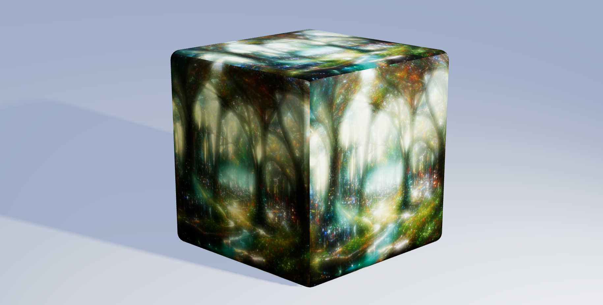

Bloom is an effect, well known to photographers and videogame developers, to intensify the bright parts of an image with a bleeding effect of brightness.

```jsx
<Layer src="image.png" bloom />

<Layer src="image.png" bloom={{size: 10, strength: 0.5, softness: 0.3 }} />
```

| key      | default value | arguments  | description                                                                                                             |
| -------- | ------------- | ---------- | ----------------------------------------------------------------------------------------------------------------------- |
| size     | `30`          | 0 to x     | Indicates the radius of the bloom effect. The higher the larger the scale of the effect.                                |
| strength | `0.9`         | 0.0 to 1.0 | The power of the effect. The higher the value the brighter the effect will remain, moving further away from the center. |
| softness | `0.7`         | 0.0 to 1.0 | The fallout of the effect. The higher the value the faster the effect will fade, moving further away from the center.   |
| detail   | `10`          | 1 to x     | The detail of the bloom effect. The higher the more instances of the effect will be drawn.                              |

#### Filters

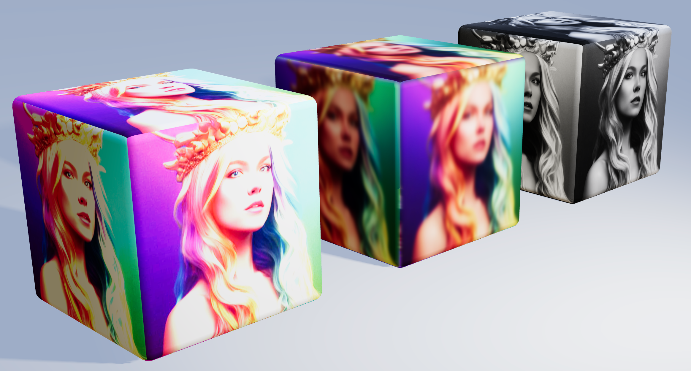

You can change brightness, contrast, saturation, blur, and many other filters. See the [filter page](https://developer.mozilla.org/en-US/docs/Web/API/CanvasRenderingContext2D/filter) of the MDN web docs for more information.

```jsx
<Layer src="image.png" filter="brightness(250%)" />

<Layer src="image.png" filter="blur(5px)" />

<Layer src="image.png" filter="saturate(0)" />

<Layer src="image.png" filter="hue-rotate(180deg)" />

<Layer src="image.png" filter="sepia(1)" />
```

#### Blending

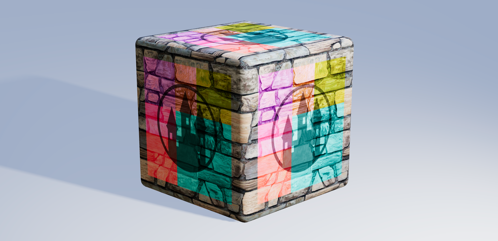

Blending is a method to mix the colors of two or more layers together by a mathematic operation. Also it is possible to change the transparency by color. See the [composition operation page](https://developer.mozilla.org/en-US/docs/Web/API/CanvasRenderingContext2D/globalCompositeOperation) of the MDN web docs for more information. Blending only has effect with two or more layers.

```jsx
<Layer color="red">
<Layer src="image.svg" color="blue" blend="lighter" />

<Layer gradient />
<Layer src="image.png" blend="overlay" />

<Layer src="image.png" />
<Layer src="image.svg" blend="xor" />
```

#### Alpha

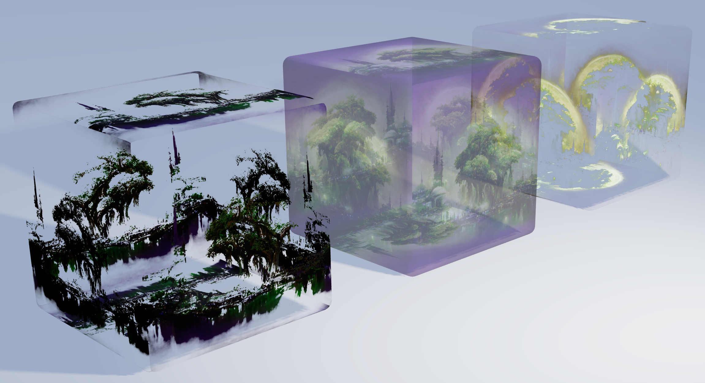

The alpha (transparency) channel can be altered in many ways. It is possible to alter the alpha channel in such a way that darker colors become more transparent. Or vice versa.

```jsx
<Layer src="image.png" alpha />

<Layer src="image.png" alpha={{ level: 0.5}} />

<Layer src="image.png" alpha={{ power: 10, offset: 0.5, reverse: true }} />
```

| key     | default value | arguments     | description                                                                                     |
| ------- | ------------- | ------------- | ----------------------------------------------------------------------------------------------- |
| level   | `1`           | 0 to 1        | The opacity of the layer. 0 means transparent, 1 means opaque.                                  |
| power   | `0`           | 0 to x        | The power of the alpha map levels. Higher power means more difference between the alpha levels. |
| offset  | `0`           | 0 to 1        | Shift the alpha levels down or up, making respectively less or more colors transparent.         |
| reverse | `false`       | true or false | Reverse the alpha channels to make lighter colors more transparent.                             |

## Known issues and Roadmap

### New layer effects

- Flip layer (x, y, both)
- Repeat layer and pattern drawing
- Drawing shapes and text
- Bevel and emboss effect
- Image scaling while maintaining aspect ratio
- Procedural rendering: clouds, perlin noise, distortion, etcetera
- Sharpen effect
- Initial setup to add more sizes than 512x512

### Technical upgrades

- Migration to Typescript
- Adding JSDoc
- Use "offscreenCanvas" for better performance
- Layer groups

## Known bugs

- Cached large images should keep their original size, instead of scaling them down to 512x512.
