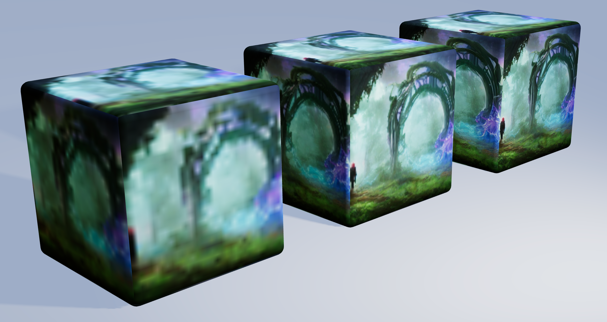
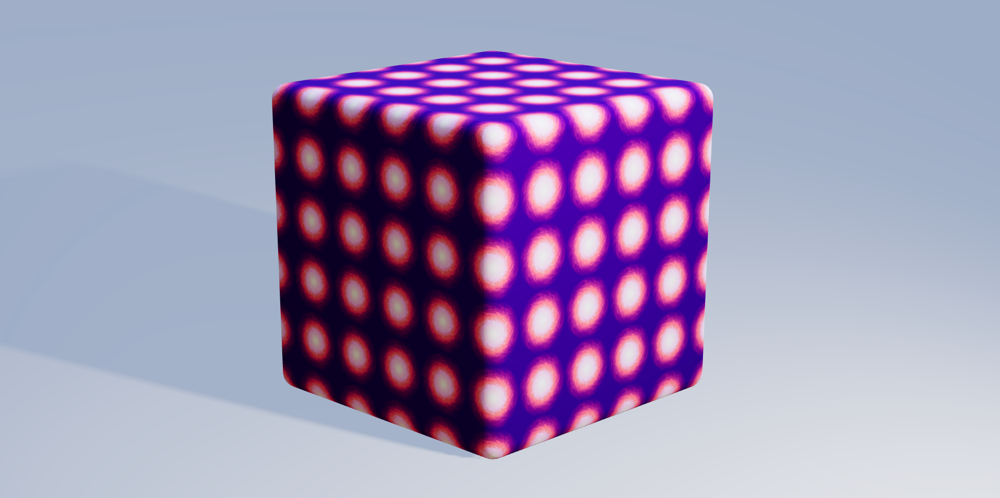
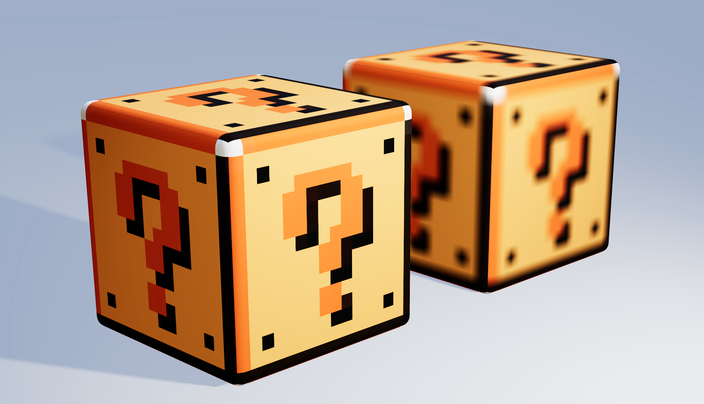
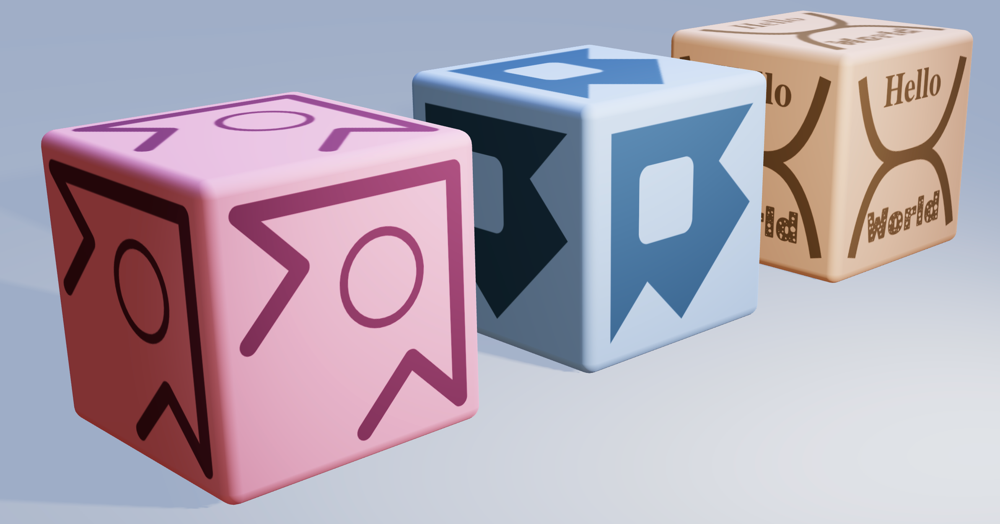

# Texture Tinker Tool

## Table of Contents

- [Texture Tinker Tool](#texture-tinker-tool)
  - [Table of Contents](#table-of-contents)
  - [Introduction](#introduction)
  - [Demo](#demo)
  - [Installation](#installation)
  - [Prerequisites](#prerequisites)
  - [Quickstart Example](#quickstart-example)
  - [Documentation](#documentation)
    - [Default Texture Settings](#default-texture-settings)
    - [Texture Set](#texture-set)
      - [Map types](#map-types)
    - [The _useTextureSet_ hook](#the-usetextureset-hook)
    - [Layer](#layer)
      - [Src](#src)
      - [Dimensions](#dimensions)
      - [Basic transformations](#basic-transformations)
      - [Image transformations](#image-transformations)
      - [Repeat](#repeat)
      - [Color](#color)
      - [Fill](#fill)
      - [Gradient](#gradient)
      - [Image smoothing\*\*](#image-smoothing)
      - [Shadow and glow](#shadow-and-glow)
      - [Outline](#outline)
      - [Bloom](#bloom)
      - [Filters](#filters)
      - [Blending](#blending)
      - [Alpha](#alpha)
      - [Shapes](#shapes)
      - [Text](#text)
  - [Q and A](#q-and-a)
    - [Disabling the smooth effect does not always work.](#disabling-the-smooth-effect-does-not-always-work)
  - [Known issues and Roadmap](#known-issues-and-roadmap)
    - [New layer effects](#new-layer-effects)
    - [Technical upgrades](#technical-upgrades)
  - [Known bugs](#known-bugs)

## Introduction

The 3D drawing tool [ThreeJS](https://threejs.org/), its React rendering solution [React Three Fiber](https://github.com/pmndrs/react-three-fiber), and on its turn the R3F abstraction library [Drei](https://github.com/pmndrs/drei) can be useful in making quick and beautiful 3D creations. And there are many other useful ThreeJS tools, helpers, libraries and documentations available around the web. However, on the level of drawing and handling _images and textures_ there is not much available, except for professional designers and experts in handling expensive photo drawing and editing programs.

So I decided to create a tool where you can draw, edit, optimize and even animate your textures in an easy-to-use React environment. In a similar way popular drawing programs can handle photos and images, you can stack layers and blend them together, transform, filter and retouch them, add effects to them and draw shapes. To increase the performance, once an image, layer or texture is loaded or rendered, it is cached and reused for when the exact same input data is called a second time.

The Texture Tinker Tool is a fast, powerful, elegant and dynamic texture editor, to use together with [ThreeJS](https://threejs.org/) and [React Three Fiber](https://github.com/pmndrs/react-three-fiber). It helps you to dynamically optimize your textures thanks to the many features available in the [Canvas Rendering Context](https://developer.mozilla.org/en-US/docs/Web/API/CanvasRenderingContext2D) interface, like [filters](https://developer.mozilla.org/en-US/docs/Web/API/CanvasRenderingContext2D/filter), [composite operations (blending)](https://developer.mozilla.org/en-US/docs/Web/API/CanvasRenderingContext2D/globalCompositeOperation), [gradient](https://developer.mozilla.org/en-US/docs/Web/API/CanvasRenderingContext2D/createLinearGradient) and additional effects like [bloom](<https://en.wikipedia.org/wiki/Bloom_(shader_effect)>), alpha channel mapping, and outline effects.

## Demo

[Texture Tinker Tool Demo](https://texture-tinker-tool.netlify.app)

## Installation

```
npm install react three @react-three/fiber react-three-texture
```

...or...

```
yarn add react three @react-three/fiber react-three-texture
```

## Prerequisites

Before you start you need to know a bit about React, ThreeJS and React Three Fiber. If you need any additional help on these topics, please refer to the following links:

- [React](https://reactjs.org/docs/getting-started.html)
- [ThreeJS](https://threejs.org/)
- [React Three Fiber](https://docs.pmnd.rs/react-three-fiber/getting-started/introduction)

## Quickstart Example


```jsx
import { TextureSet, Layer } from "react-three-texture";

const ExampleBox = () => (
  <mesh castShadow>
    <boxBufferGeometry attach="geometry" />
    <meshStandardMaterial attach="material">
    <TextureSet>
      <Layer fill="blue" />
      <Layer gradient blend="lighter" />
      <Layer src="burger.svg" scale={[0.5, 0.5]} image="center middle" blend="hard-light" />
    </TextureSet>
  </mesh>
)
```

## Documentation

### Default Texture Settings

To apply texture settings globally and for all textures defined in the texture sets, call the texture default function at the top level of your application. All the available layer settings can be defined here.

```js
textureGlobals({
  dimensions: 512,
  filter: "contrast(85%) brightness(110%)",
});
```

### Texture Set

A texture containing a set of layers. A `map` propertly can be added to determine the type of map. Also the `dimensions` can be defined for this texture. Additionally, all features like `offset`, `repeat` and `rotation` that are normally available for the basic `Texture` object, can also be used here. Its children can only be layers. [Read more about ThreeJS Textures](https://threejs.org/docs/#api/en/textures/Texture).

```jsx
<TextureSet offset={[0.5, 0.5]}>...</TextureSet>

<TextureSet map="bump">...</TextureSet>

<TextureSet map="env" dimensions={1024}>...</TextureSet>
```

#### Map types

The following map types are available. When no `map` property is defined, by default the color map is used. Technically, all `Material` properties ending with `Map` can be used as a `TextureSet` property.

- `env`
- `specular`
- `displacement`
- `normal`
- `bump`
- `roughness`
- `metalness`
- `alpha`
- `light`
- `emissive`
- `clearcoat`
- `clearcoatNormal`
- `clearcoatRoughness`
- `sheenRoughness`
- `sheenColor`
- `specularIntensity`
- `specularColor`
- `thickness`
- `transmission`
- `ao`

### The _useTextureSet_ hook

Alternatively, the texture can be built by using the `useTextureSet` hook. The hook returns a `CanvasTexture` object, which can directly be used as a texture map. When applying the texture to a material, be sure to update the material, using `material.needsUpdate = true`.

```jsx
const texture = useTextureSet(
  <>
    <Layer fill="darkBlue" />
    <Layer circle={[0.5, 0.5, 0.4]} color="lightBlue" />
  </>,
  1024
);

<meshStandardMaterial attach="material" map={texture} bumpMap={texture} />;
```

| arguments   | example                | type    | description                                                                                        |
| ----------- | ---------------------- | ------- | -------------------------------------------------------------------------------------------------- |
| layer       | `<Layer fill="red" />` | JSX     | A React Node object containing all the layers                                                      |
| dimensions? | `512`                  | number  | The width and height of the texture, in pixels                                                     |
| isEnvMap?   | `true`                 | boolean | When the type is an environment map, set this to true to be sure the PMREM is correctly generated. |

### Layer

[](./public/readme-layer.png)

Layers are like a stack of transparent film paper, used in old animated movies. The bottom layer will be shown at the back, then the second layer, etcetera. All layers together will form one single texture.

```jsx
<Layer {...props1} /> // Will be drawn first and is displayed in the back
<Layer {...props2} />
<Layer {...props3} />
<Layer {...props4} /> // Will be drawn last and is displayed in the front
```

#### Src


Will directly load an image source onto the texture. All loaded images will be cached, to increase performance. I.e. when the same image is used somewhere else there will be no reloading. It is also possible to load SVG files, and even external sources can be used. The root folder for the source files is `/src/assets`.

```jsx
<Layer src="image.png" />

<Layer src="image.svg" />

<Layer src="https://images.unsplash.com/photo-1581373449483-37449f962b6c" />
```

#### Dimensions



You can set the width and the height (in pixels) for the layer. By default the texture dimensions are 512x512 pixels. Note, that if you wish to set the dimensions higher than the [Default Texture Settings](#default-texture-settings), you also need to increase it there.

```jsx
<Layer src="image.png" dimensions={64} />

<Layer src="image.png" dimensions={256} />
```

#### Basic transformations


All layers can separately be moved, scaled and rotated, relative to the texture.

```jsx
<Layer src="image.png" position={[0.5, 0.5]} />

<Layer src="image.png" position={[0.2, 0.2]} scale={[0.8, 0.8]} />

<Layer src="image.png" rotation={Math.PI * 0.5} />
```

| property | default value | arguments | description                                                                                            |
| -------- | ------------- | --------- | ------------------------------------------------------------------------------------------------------ |
| position | `[0, 0]`      | x, y      | The position of the layer.                                                                             |
| scale    | `[1, 1]`      | w, h      | The scale of the layer.                                                                                |
| rotation | `0`           | rad       | The rotation of the layer in radians. The rotation will be done relative to the center of the texture. |

#### Image transformations


Images that are not exactly square sized can be fit in the texture as we like without getting deformed. We can choose to fit a rectangular sized image on a square sized texture, while keeping the aspect ratio of the image. Also, when the image is too big to fit on the texture we can choose to position the image to a side.

```jsx
<Layer src="image.png" image /> // "fit-max center middle"

<Layer src="image.png" image="fit-max" />

<Layer src="image.png" image="fit-x center middle" />
```

| string        | description                                                                                                                       |
| ------------- | --------------------------------------------------------------------------------------------------------------------------------- |
| fit-fill \*\* | Image will be resized to match the given dimension, and may stretch it to fit.                                                    |
| fit-max \*    | Will fit the image to whichever side (width or height) is smaller, and keeping the image's aspect ratio. This may clip the image. |
| fit-min       | Will fit the image to whichever side (width or height) is larger, and keeping the image's aspect ratio.                           |
| fit-x         | Will fit the image to its width, and keeping the image's aspect ratio.                                                            |
| fit-y         | Will fit the image to its height, and keeping the image's aspect ratio.                                                           |
| fit-none      | Will not fit the image and will keep its original size.                                                                           |
| top \*\*      | Will align the image to the top.                                                                                                  |
| right         | Will align the image to the right.                                                                                                |
| bottom \*\*   | Will align the image to the bottom.                                                                                               |
| left          | Will align the image to the left.                                                                                                 |
| center \*     | Will horizontally align the image to the center.                                                                                  |
| middle \*     | Will vertically align the image to the middle.                                                                                    |

\* default, when defining the property "image" without a value

\*\* default, when not defining the property "image"

#### Repeat



Instead of a single render of a layer, it is also possible to repeat it as a pattern. When scaling the layer down, the pattern will become visible.

```jsx
<Layer src="image.png" scale={[0.2, 0.2]} repeat />
```

#### Color


Overwrite the colors in your layers with a single color. Useful to colorize your monochrome SVG images. When setting the alpha channel lower than 100% it will blend the original colors with the overwritten color.

```jsx
<Layer src="image.png" color /> // "white"

<Layer src="image.png" color="red" />

<Layer src="image.png" color="#ff000080" />

<Layer src="image.png" color="#rgba(255, 255, 0, 0.7)" />
```

#### Fill


Will fill the layer with a single color. The alpha channel can also be used to make the fill color (semi-)transparent.

```jsx
<Layer fill /> // "black"

<Layer fill="darkBlue" />

<Layer fill="#00ff00" />

<Layer fill="rgb(128, 0, 128)" />
```

#### Gradient


Gradients is an operation to smoothly blend two or more colors into each other. See the [linear gradient page](https://developer.mozilla.org/en-US/docs/Web/API/CanvasRenderingContext2D/createLinearGradient) and the [radial gradient page](https://developer.mozilla.org/en-US/docs/Web/API/CanvasRenderingContext2D/createRadialGradient) of the MDN web docs for more information.

```jsx
<Layer gradient /> // { type: "linear", from: [0, 0], to: [0, 1], stops: [[0, "white"], [1, "black"]] }

<Layer gradient={{ stops: [[0, "#008800"], [1, "#88ff88"]] }} />

<Layer
  gradient={{
    type: "radial",
    from: [0.5, 0.5, 0],
    to: [0.5, 0.5, 0.75],
    stops: [
      [0, "yellow"],
      [0.4, "red"],
      [1, "blue"],
    ],
  }}
/>
```

| key   | default value                  | arguments        | description                                                                                           |
| ----- | ------------------------------ | ---------------- | ----------------------------------------------------------------------------------------------------- |
| type  | `"linear"`                     | linear or radial | the type of gradient. Can be linear or radial.                                                        |
| from  | `[0, 0]` or `[0.5, 0.5, 0]`    | x, y, r?         | The starting point of the gradient. The radius `r` only applies for radial gradients.                 |
| to    | `[0, 1]` or `[0.5, 0.5, 1]`    | x, y, r?         | The end point of the gradient. The radius `r` only applies for radial gradients.                      |
| stops | `[[0, "white"], [1, "black"]]` | index, color     | The stop index and color between the start and the end point. Multiply stops and indexes can be used. |

#### Image smoothing\*\*



Turn off image smoothing for the layer (the "nearest neighbour" algorithm), when scaling/fitting the image. See the [image smoothing page](https://developer.mozilla.org/en-US/docs/Web/API/CanvasRenderingContext2D/imageSmoothingEnabled) of the MDN web docs for more information.

```jsx
<Layer img="image.png" nearest /> // true
```

_\*\* Unfortunately, currently image smoothing is not working in most of the browsers_

#### Shadow and glow


Apply a shadow (or glow) effect to the layer. See the [shadow page](https://developer.mozilla.org/en-US/docs/Web/API/CanvasRenderingContext2D/shadowBlur) of the MDN web docs for more information.

```jsx
<Layer src="image.svg" shadow /> // { color: "black", blur: 20, offset: [0, 0] }

<Layer src="image.svg" shadow={{ color: "white", blur: 30, offset: [-5, 5] }} />
```

| key    | default value | arguments | description                                        |
| ------ | ------------- | --------- | -------------------------------------------------- |
| color  | `"black"`     |           | The color of the effect                            |
| blur   | `20`          | 0 to x    | The blur radius of the effect                      |
| offset | `[0, 0]`      | x, y      | The position offset from the center of the effect. |

#### Outline


You can give your image an outline effect. Other than shadow or glow, outline will not be smooth and does not have an offset.

```jsx
<Layer src="image.svg" outline /> // { color: "black", size: 1, detail: 8 }

<Layer src="image.svg" outline={{ color: "#ff00ff", size: 10, detail: 10 }} />
```

| key     | default value | arguments | description                                                                                  |
| ------- | ------------- | --------- | -------------------------------------------------------------------------------------------- |
| color   | `"black"`     |           | The color of the outline.                                                                    |
| size    | `1`           | 1 to x    | The thickness of the outline.                                                                |
| quality | `8`           | 1 to x    | The detail of the outline effect. The higher the more instances of the effect will be drawn. |

#### Bloom


Bloom is an effect, well known to photographers and videogame developers, to intensify the light parts of an image with a bleeding effect of brightness.

```jsx
<Layer src="image.png" bloom /> // { size: 30, strength: 0.4, softness: 0.7, detail: 10, darken: false }

<Layer src="image.png" bloom={{ size: 10, strength: 0.5, softness: 0.3 }} />

<Layer src="image.png" bloom={{ size: 10, strength: 0.5, detail: 4, darken: true }} />

```

| key      | default value | arguments  | description                                                                                                             |
| -------- | ------------- | ---------- | ----------------------------------------------------------------------------------------------------------------------- |
| size     | `30`          | 0 to x     | Indicates the radius of the bloom effect. The higher the larger the scale of the effect.                                |
| strength | `0.4`         | 0.0 to 1.0 | The power of the effect. The higher the value the brighter the effect will remain, moving further away from the center. |
| softness | `0.7`         | 0.0 to 1.0 | The fallout of the effect. The higher the value the faster the effect will fade, moving further away from the center.   |
| detail   | `10`          | 1 to x     | The detail of the bloom effect. The higher the more instances of the effect will be drawn.                              |
| darken   | `false`       | boolean    | Optionally darken the effect.                                                                                           |

#### Filters


You can change brightness, contrast, saturation, blur, and many other filters. See the [filter page](https://developer.mozilla.org/en-US/docs/Web/API/CanvasRenderingContext2D/filter) of the MDN web docs for more information.

```jsx
<Layer src="image.png" filter="brightness(250%)" />

<Layer src="image.png" filter="blur(5px)" />

<Layer src="image.png" filter="saturate(0)" />

<Layer src="image.png" filter="hue-rotate(180deg) sepia(0.5)" />
```

#### Blending


Blending is a method to mix the colors of two or more layers together by a mathematic operation. Also it is possible to change the transparency by color. See the [composition operation page](https://developer.mozilla.org/en-US/docs/Web/API/CanvasRenderingContext2D/globalCompositeOperation) of the MDN web docs for more information. Blending only has effect with two or more layers.

```jsx
<Layer color="red">
<Layer src="image.svg" color="blue" blend="lighter" />

<Layer gradient />
<Layer src="image.png" blend="overlay" />

<Layer src="image.png" />
<Layer src="image.svg" blend="xor" />
```

#### Alpha


The alpha (transparency) channel can be altered in many ways. It is possible to alter the alpha channel in such a way that darker colors become more transparent. Or vice versa.

```jsx
<Layer src="image.png" alpha={0.5} /> // level: 0.5

<Layer src="image.png" alpha /> // { level: 1, power: 1, offset: 0, reverse: false }

<Layer src="image.png" alpha={{ level: 0.5}} />

<Layer src="image.png" alpha={{ power: 10, offset: 0.5, reverse: true }} />
```

| key     | default value | arguments     | description                                                                                     |
| ------- | ------------- | ------------- | ----------------------------------------------------------------------------------------------- |
| level   | `1`           | 0 to 1        | The opacity of the layer. 0 means transparent, 1 means opaque.                                  |
| power   | `1`           | 0 to x        | The power of the alpha map levels. Higher power means more difference between the alpha levels. |
| offset  | `0`           | 0 to 1        | Shift the alpha levels down or up, making respectively less or more colors transparent.         |
| reverse | `false`       | true or false | Reverse the alpha channels to make lighter colors more transparent.                             |

#### Shapes



A variety of basic shapes can be drawn on a layer. Think of lines, curved lines, circles or rectanges.

```jsx
<Layer line={[0.1, 0.1, 0.9, 0.9, 0.9, 0.1]} shapeThickness={32} shapeRounded />

<Layer curved={[0.1, 0.1, 0.9, 0.9, 0.9, 0.1]} shapeThickness={16} />

<Layer circle={[0.5, 0.5, 0.7, 0.4]} />

<Layer rect={[0.2, 0.3, 0.6, 0.4, 0.1]} />
```

| property       | default value | arguments                                   | description                                                                                                                                                                                                                                                                          |
| -------------- | ------------- | ------------------------------------------- | ------------------------------------------------------------------------------------------------------------------------------------------------------------------------------------------------------------------------------------------------------------------------------------ |
| shapeThickness | `0`           | 0 to x                                      | The thickness of the shape. Will work with all shapes. A shape thickness of 0 will fill the shape.                                                                                                                                                                                   |
| shapeRounded   | `false`       | true or false                               | Will make lines rounded in the corners, and lines and curved lines rounded on the start and end points.                                                                                                                                                                              |
| line           |               | x1, y1, x2, y2, ...                         | Draw a line from one coordinate to the next. Ending with the same point as the starting point will close the path.                                                                                                                                                                   |
| curved         |               | x1, y1, x2, y2, x3, y3, x4?, y4?            | Draw a curved line from one coordinate to the next. Can be a bezier curve (3 points), or a quadratic curve (4 points).                                                                                                                                                               |
| circle         |               | x, y, rx, ry?, rotation?, start?, end?, cc? | Will draw a circle at a certain point `x, y` and a radius of `rx`. When a second radius `ry` is defined the circle will become an ellipse, and with the start and end point defined the circle is only partly drawn. Optionally the circle can be drawn counter-clockwise with `cc`. |
| rect           |               | x, y, w, h?, rounded?                       | Will draw a rectangle at a certain point `x, y` and a fixed size of `w` and and optional height of `h`. It is also possible to give the rectangle rounded corners.                                                                                                                   |

#### Text

Texts can be created in all sorts of types, styles, colors and sizes. Font faces can also be retreived from files or a url. The property `shapeThickness` can also be used here, to create outlined text.

```jsx
<Layer text={{ value: "Lorem ipsum" }}  />

<Layer text={{ value: "This is a nice text-ure", font: "Arial", weight: "bold" }} color="red" position={[0.5, 0.5]} scale={[0.1, 0.1]} />

<Layer text={{
    value: "Texts can be created in all sorts of types, styles, colors and sizes.",
    font: "fonts/myLovelyFont.otf",
    width: {0.8}
    height: {1.0}
    align: "center",
    base: "middle"
  }}
  position={[0.5, 0.5]}
  scale={[0.1, 0.1]}
/>
```

| key    | default value | arguments             | description                                                                                                                                                                                             |
| ------ | ------------- | --------------------- | ------------------------------------------------------------------------------------------------------------------------------------------------------------------------------------------------------- |
| value  |               | string                | The text value.                                                                                                                                                                                         |
| font   | `serif`       | string                | The font family of the text. System fonts can be used, but also a path to a custom font file, or even a url can be used to retreive a font face. The root folder for the source files is `/src/assets`. |
| style  |               | string                | The font style. For example `italic` or `oblique`.                                                                                                                                                      |
| weight |               | string                | The font weight. Examples are `bold` or `lighter`, but you can use number values to define the strength of the weight.                                                                                  |
| width  | `0`           | number                | The maximum width of the text. When the text exceeds this width, the words will wrap down to the next line. The value is a factor of the full width of the layer. A value of 0 will not wrap the text.  |
| height | `1.3`         | number                | The line height of the text. The number is a multiplier for the height of the font.                                                                                                                     |
| align  | `center`      | left, center of right | The horizontal alignment of the text. The text will orientate around the position of the layer.                                                                                                         |
| base   | `middle`      | top, middle or bottom | The vertical alignment of the text. The text will orientate around the position of the layer.                                                                                                           |

## Q and A

### Disabling the smooth effect does not always work.

When using the `nearest` property, the texture's smooth effect is not always disabled. Then try to use the ThreeJS `texture.magFilter = THREE.NearestFilter` value instead.

## Known issues and Roadmap

### New layer effects

- [ ] Flip layer (x, y, both)
- [x] Repeat layer and pattern drawing
- [x] Drawing shapes and text
- [ ] Inner shadow/glow
- [ ] Bevel and emboss effect
- [ ] Image scaling while maintaining aspect ratio
- [ ] Seamless rendering
- [ ] Procedural rendering
  - [ ] clouds
  - [ ] perlin noise
  - [ ] distortion
  - [ ] walls
- [ ] Sharpen effect
- [x] Initial setup to add more sizes than 512x512

### Technical upgrades

- [x] Migration to Typescript
- [ ] Adding JSDoc
- [ ] Use "offscreenCanvas" for better performance
- [ ] Layer groups

## Known bugs

- [x] Cached large images should keep their original size, instead of scaling them down to 512x512.

---

- [ ] _to do_
- [x] _completed_
