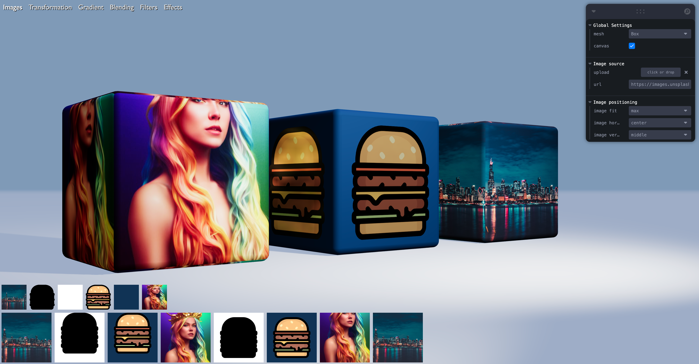

# Texture Tinker Tool - Example Demo



## Introduction

This is an examples demo of the Texture Tinker Tool. Go to https://github.com/jnieberg/react-three-texture for more information about this package.

## Installation and Run

### Yarn

```
git clone https://github.com/jnieberg/react-three-texture.git
cd react-three-texture/examples
yarn
yarn start
```

### NPM

```
git clone https://github.com/jnieberg/react-three-texture.git
cd react-three-texture/examples
npm install
npm start
```
